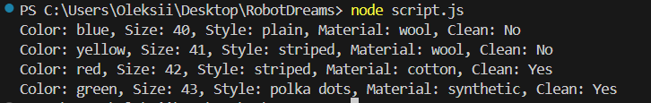

# 🧦 Lost Socks Finder — Documentation

## 📋 Task Description:

Create a single line of code that collects all lost socks from the laundry, which means finding unique elements in an array and sorting them by size and cleanliness (clean socks first).

## 💡 Solution Overview:
__We will:__

1. Remove duplicate socks from the array;
2. Sort the socks by size (ascending) and then by cleanliness (clean first);
3. Output the result in a readable format.

## 🚀 How to Compile/Interpret:

__Pre-requisites:__
Ensure you have Node.js installed on your system, If not, download and install it from Node.js official website.

__Steps to Run:__ 
1. Create a file named socks.js and paste the code into it.

2. Open your terminal/command prompt and navigate to the folder where the socks.js file is saved.

3. Run the following command:
__node script.js__

4. You will see the following output (depending on your input data):    
  
``` 
Color: blue, Size: 40, Style: plain, Material: wool, Clean: No
Color: yellow, Size: 41, Style: striped, Material: wool, Clean: No
Color: red, Size: 42, Style: striped, Material: cotton, Clean: Yes
Color: green, Size: 43, Style: polka dots, Material: synthetic, Clean: Yes 
```



